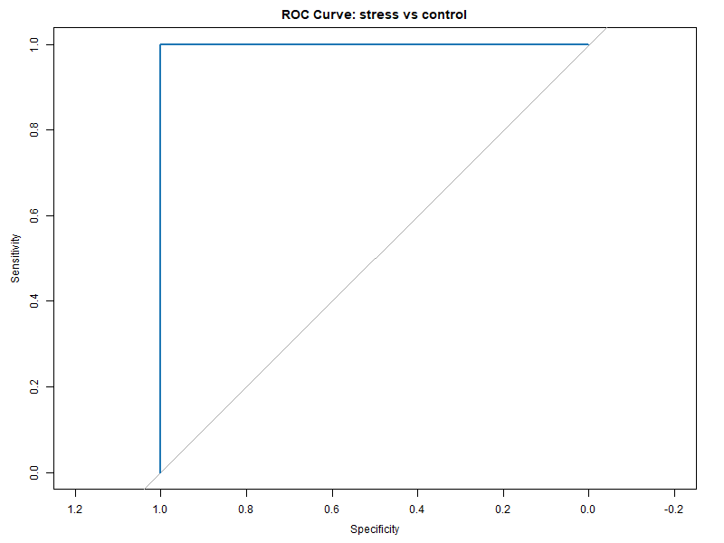
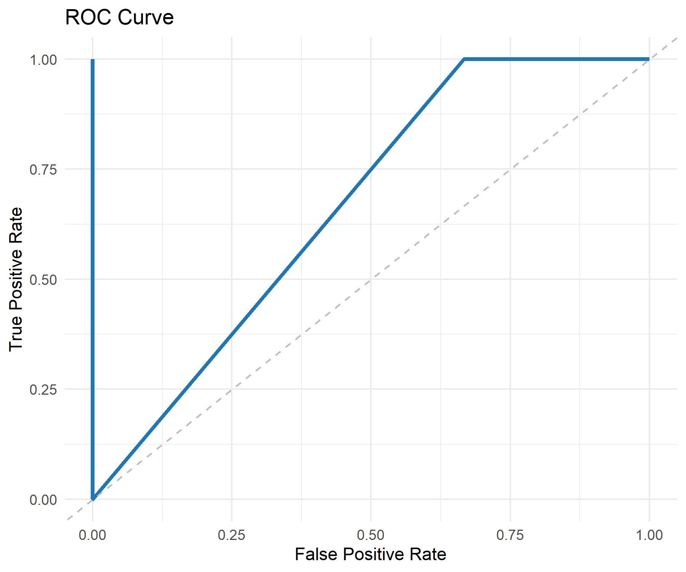
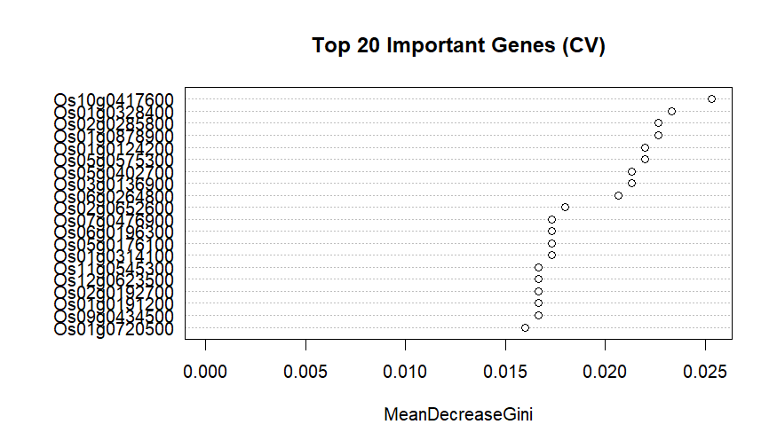

# Gene-Importance-Analysis-in-Stress-Response-Using-Random-Forest
This repository contains a machine learning pipeline for identifying key genes involved in stress response in rice (*Oryza sativa*), using RNA-seq expression data and Random Forest classification.
## Project Overview

- **Goal**: To classify control vs. stress samples and identify genes with the highest predictive importance.
- **Data**: RNA-seq expression matrix (preprocessed; top 500 high-variance genes selected).
- **Model**: Random Forest with cross-validation and ROC/AUC evaluation.
- **Output**: Confusion matrix, ROC curve, AUC score, and ranked list of important genes.

## Repository Structure
├── data/           # (Optional) Raw or processed expression data  
├── scripts/        # R scripts for preprocessing, modeling, and visualization  
├── results/        # Output tables (confusion matrix, gene importance, etc.)  
├── figures/        # ROC curve, feature importance plots  
├── methods.md      # Detailed description of analysis steps  
├── README.md       # Project summary and usage  

## Key Results
- **Accuracy**: 100% on training set *(note: may reflect overfitting due to limited sample size)*  
- **AUC**: ~1.00 *(training set only; cross-validation used to assess generalizability)*  
- **Top Gene**: Os10g0417600 (highest MeanDecreaseGini)
## Visualizations
### ROC Curve

This curve shows the model's ability to distinguish between control and stress samples.  
AUC ≈ 1.00 indicates high classification performance, though overfitting is likely due to small sample size.
### Feature Importance

Os10g0417600 was identified as the most influential gene based on MeanDecreaseGini.  
This plot ranks the top 20 genes contributing to model decisions.
## Limitations
This project demonstrates a Random Forest-based classification of control vs. stress conditions using RNA-seq data. While the model achieved perfect accuracy and AUC on the training set, this performance likely reflects overfitting due to the limited sample size and lack of an independent test set.
Key limitations include:
- Small number of samples, which restricts generalizability  
- No external validation set to assess model performance on unseen data  
- Potential bias introduced by selecting top 500 genes based solely on variance  
- Feature importance may reflect statistical noise rather than biological relevance
## Future Work
To address these limitations and improve model robustness, future steps will include:
- Implementing stratified cross-validation with more folds  
- Comparing Random Forest with alternative models such as SVM and LASSO  
- Incorporating external datasets for independent validation  
- Applying biological filters (e.g., DEGs, GO terms) for more meaningful feature selection  
- Publishing a reproducible pipeline with clearer documentation and modular structure
This repository remains a transparent record of the modeling process and serves as a foundation for future refinement and publication.
## Usage
1. Clone the repository  
2. Place your expression matrix in the `data/` folder  
3. Run `scripts/analysis.R` to reproduce results  
4. Outputs will be saved in `results/` and `figures/`
## Requirements
- R (version ≥ 4.0)  
- Required packages: `randomForest`, `pROC`, `caret`, `ggplot2`
## Data Availability
Due to future publication plans, raw expression data is not publicly shared.  
However, all scripts and documentation are provided for reproducibility.
## Author
Zahra Sabili  
Fars, Iran  
Plant Biotechnology & Bioinformatics Researcher | MSc Graduate
Email: ztsabili96@gmail.com
## Citation
If you use this repository or its methods, please cite:  
**Sabili, Z. (2025). Gene Importance Analysis in Stress Response. GitHub Repository.**

